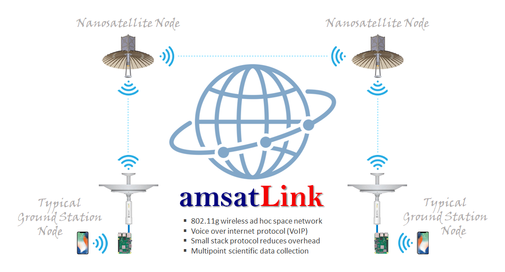

# amsatLink

**amsatLink** is a proposed three-phased program to ultimately establish a constellation of nanosatellites, linked in a peer-to-peer voice communications network for amateur satellite service.  As a wireless ad hoc network, future satellites can be added to the network and ground stations, moving in and out of a nanosatellite node’s footprint, can easily join and exit the network.

## Features:

- IEEE 802.11 wireless ad hoc network, operating within the FCC Part 97 amateur radio frequency allocation of the 2.4 GHz microwave band

- Individual satellite and ground nodes connect directly, dynamically, and non-hierarchically to as many other nodes as possible and cooperate with one another to create one virtual network that can efficiently route data from/to clients.

- If one endpoint cannot see its desired destination, but can see nodes in between, the data will hop from one to the next until the final connection is made – completely and automatically.

- Small stack protocol to reduce overhead and ease communications between network nodes

- Absolute timing obtained from GPS

In addition, as a constellation of nanosatellites orbiting the Earth, **amsatLink** allows for the multipoint collection of space weather measurements, which contribute a unique and invaluable set of scientific data for scientific and educational analysis.

While the idea of cross-link communication between satellites is not new, **amsatLink** hopes to continue the efforts of NASA’s *PhoneSat*, *EDSN* constellation, and *NODES* missions, by

- expanding the network to include ground-based nodes,

- demonstrating the use of voice over internet protocol communications, and

- organizing nodes into clusters, where each cluster consists of one nanosatellite node and any visible ground nodes.

**amsatLink** will continue NASA’s design philosophy by utilizing commercial-off-the-shelf hardware and keeping the design and mission objectives as simple as possible.  Estimated total hardware cost per satellite is less than $5,000.  Proposed ground stations will also use off the shelf equipment with a total estimated cost of less than $150.

## Phase 1 ##
Design and build working prototypes of both nanosatellite and ground nodes as a proof of concept and test systems integration.  Testing will include a terrestrial-based simulation and a high-altitude (60,000 – 105,000 feet ASL) simulation as payload aboard high-altitude balloon launch.

## Phase 2 ##
Build two 1.5u nanosatellite nodes and launch them from the ISS as a technology demonstrator of a peer-to-peer communications network.  Due to the expected orbit being only 400km-415km, we expect a short mission lifetime of only one to two weeks.

## Phase 3 ##
Initial deployment of a three-1.5u nanosatellite formation at an optimal orbital altitude.  Subsequent launches will add nodes to the network, greatly expanding the cross-link coverage area.

## License:
[CC0-1.0](./LICENSE).
